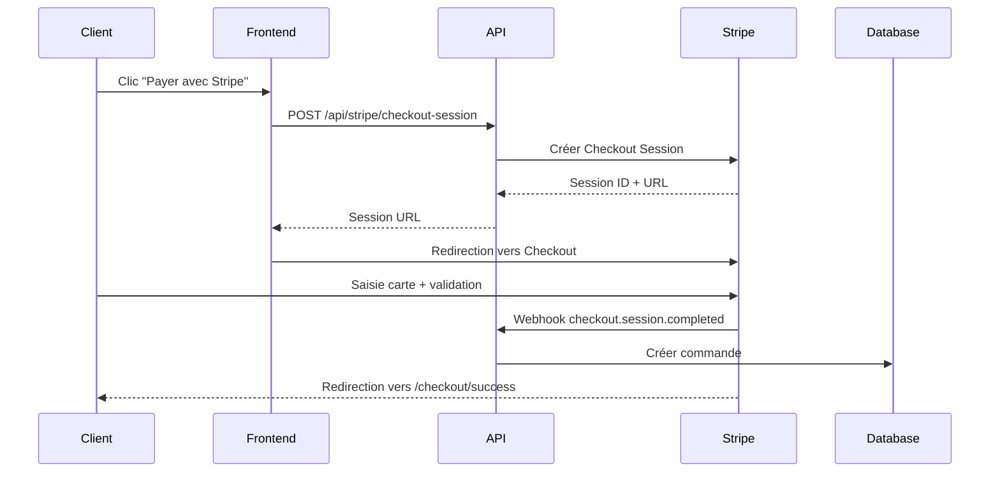

# 💳 Configuration Stripe - Mode Test

## 📋 Prérequis

1. Créer un compte Stripe : https://dashboard.stripe.com/register
2. Activer le mode test (toggle en haut à droite du dashboard)

---

## 🔑 Configuration des Clés API

### 1. Récupérer les clés de test

Aller sur : https://dashboard.stripe.com/test/apikeys

- **Clé publique** (Publishable key) : commence par `pk_test_...`
- **Clé secrète** (Secret key) : commence par `sk_test_...`

### 2. Ajouter les variables d'environnement

Créer/modifier le fichier `.env.local` à la racine du projet :

```env
# Stripe Keys (Mode Test)
NEXT_PUBLIC_STRIPE_PUBLISHABLE_KEY=pk_test_VOTRE_CLE_PUBLIQUE
STRIPE_SECRET_KEY=sk_test_VOTRE_CLE_SECRETE

# Webhook Secret (voir section Webhooks ci-dessous)
STRIPE_WEBHOOK_SECRET=whsec_VOTRE_WEBHOOK_SECRET
```

### 3. Ajouter `.env.local` au `.gitignore`

⚠️ **IMPORTANT** : Ne jamais committer les clés API !

```gitignore
.env.local
.env*.local
```

---

## 🔔 Configuration des Webhooks

Les webhooks permettent à Stripe de notifier votre application des événements (paiement réussi, etc.).

### En local (développement)

1. Installer Stripe CLI : https://stripe.com/docs/stripe-cli

```bash
# macOS
brew install stripe/stripe-cli/stripe

# Windows
scoop install stripe

# Linux
# Télécharger depuis : https://github.com/stripe/stripe-cli/releases
```

2. Se connecter :

```bash
stripe login
```

3. Lancer le webhook listener :

```bash
stripe listen --forward-to localhost:3000/api/stripe/webhook
```

4. Copier le **webhook signing secret** (commence par `whsec_...`) dans `.env.local` :

```env
STRIPE_WEBHOOK_SECRET=whsec_...
```

### En production (Vercel)

1. Aller sur : https://dashboard.stripe.com/test/webhooks
2. Cliquer sur **"Add endpoint"**
3. URL de l'endpoint : `https://votre-domaine.com/api/stripe/webhook`
4. Sélectionner l'événement : `checkout.session.completed`
5. Copier le **Signing secret** et l'ajouter dans Vercel :
   - Aller dans **Settings > Environment Variables**
   - Ajouter `STRIPE_WEBHOOK_SECRET` avec la valeur du signing secret

---

## 🧪 Test du Paiement

### Cartes de test Stripe

Utiliser ces numéros de carte pour tester :

✅ **Paiement réussi** :

```
Numéro : 4242 4242 4242 4242
Date : N'importe quelle date future (ex: 12/25)
CVC : N'importe quel 3 chiffres (ex: 123)
Code postal : N'importe lequel
```

❌ **Paiement refusé** :

```
Numéro : 4000 0000 0000 0002
Date : N'importe quelle date future
CVC : N'importe quel 3 chiffres
```

🔐 **Authentification 3D Secure** :

```
Numéro : 4000 0027 6000 3184
Date : N'importe quelle date future
CVC : N'importe quel 3 chiffres
```

Plus de cartes de test : https://stripe.com/docs/testing

---

## 🚀 Démarrage

### 1. Installer les dépendances

```bash
npm install
```

### 2. Démarrer le serveur de développement

```bash
npm run dev
```

### 3. Dans un autre terminal, lancer le webhook listener

```bash
stripe listen --forward-to localhost:3000/api/stripe/webhook
```

### 4. Tester le paiement

1. Aller sur : http://localhost:3000/checkout
2. Sélectionner une adresse de livraison
3. Choisir "Carte bancaire (Stripe)"
4. Cliquer sur "Payer avec Stripe"
5. Utiliser une carte de test (ex: `4242 4242 4242 4242`)
6. Valider le paiement

---

## 📊 Suivi des Paiements

### Dashboard Stripe (Mode Test)

Aller sur : https://dashboard.stripe.com/test/payments

Vous verrez tous les paiements de test effectués.

### Logs des Webhooks

Les événements webhook sont visibles dans :

- **Local** : Terminal où `stripe listen` est lancé
- **Production** : https://dashboard.stripe.com/test/webhooks (cliquer sur l'endpoint)

---

## 🔄 Flux de Paiement



---

## 🛡️ Sécurité

### Bonnes Pratiques

1. ✅ **Ne jamais exposer la clé secrète** (`STRIPE_SECRET_KEY`)
2. ✅ **Toujours vérifier la signature des webhooks**
3. ✅ **Utiliser HTTPS en production**
4. ✅ **Valider les montants côté serveur**
5. ✅ **Logger tous les événements importants**

### Variables d'environnement

- `NEXT_PUBLIC_STRIPE_PUBLISHABLE_KEY` : Visible côté client (OK)
- `STRIPE_SECRET_KEY` : Jamais exposée au client (serveur uniquement)
- `STRIPE_WEBHOOK_SECRET` : Vérification de la signature des webhooks

---

## 🔄 Migration vers Production

### 1. Activer le compte Stripe

- Remplir les informations de l'entreprise
- Activer les paiements en mode live

### 2. Récupérer les clés de production

Aller sur : https://dashboard.stripe.com/apikeys (mode **Live**)

### 3. Mettre à jour les variables d'environnement

Dans Vercel > Settings > Environment Variables :

```env
NEXT_PUBLIC_STRIPE_PUBLISHABLE_KEY=pk_live_VOTRE_CLE_PUBLIQUE
STRIPE_SECRET_KEY=sk_live_VOTRE_CLE_SECRETE
STRIPE_WEBHOOK_SECRET=whsec_VOTRE_WEBHOOK_SECRET_LIVE
```

### 4. Créer le webhook en production

- URL : `https://votre-domaine.com/api/stripe/webhook`
- Événement : `checkout.session.completed`

---

## 🐛 Dépannage

### Erreur "Invalid API Key"

- Vérifier que les clés sont correctes dans `.env.local`
- Redémarrer le serveur après modification des variables d'environnement

### Webhook non reçu

- Vérifier que `stripe listen` est lancé (local)
- Vérifier le signing secret dans `.env.local`
- Vérifier les logs du webhook dans le dashboard Stripe

### Paiement réussi mais commande non créée

- Vérifier les logs du webhook
- Vérifier la connexion à la base de données
- Vérifier que les champs de la table `Order` correspondent

---

## 📚 Ressources

- Documentation Stripe : https://stripe.com/docs
- API Reference : https://stripe.com/docs/api
- Cartes de test : https://stripe.com/docs/testing
- Stripe CLI : https://stripe.com/docs/stripe-cli
- Webhooks : https://stripe.com/docs/webhooks

---

## 🎯 Résumé des Fichiers Créés

```
src/
├── lib/
│   ├── stripe.ts                          # Client Stripe côté serveur
│   └── stripe-client.ts                   # Client Stripe côté client
├── app/
│   ├── api/
│   │   └── stripe/
│   │       ├── checkout-session/route.ts  # Créer session de paiement
│   │       ├── webhook/route.ts           # Recevoir événements Stripe
│   │       └── session/route.ts           # Récupérer détails session
│   └── checkout/
│       ├── page.tsx                       # Page checkout (modifiée)
│       └── success/
│           └── page.tsx                   # Page de succès
```

---

✅ **Stripe est maintenant configuré en mode test !**

